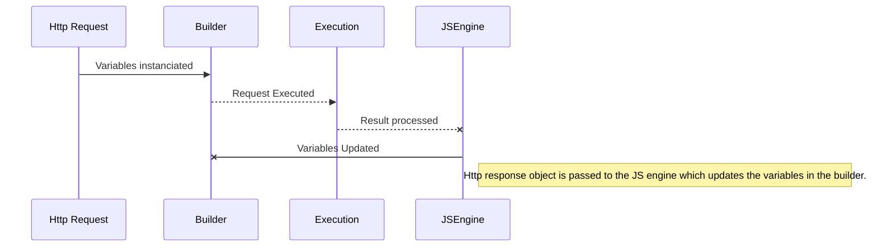

# Jayman

Jayman is a C# program that executes Postman collections.
Uses the V8 Clear Script Javascript engine for managing a JS state

## Supports

* Postman Enviroment file
* Postman Collection file
* Collection , Enviroment and Global variables 
* JS "prerequest" and "test" scripts 
* JS Next Execution Call
* JS atob and Moment plug ins

## Help

| Command | Description |
|--|--|
| `-v`, `--version` | Display version |
| `-h`, `--help` | Display help menu |
| `--enviroment={filePath}` | Set the Enviroment configuration file to use |
| `--collection={filePath}` | Set the Collection file to execute |
| `--injectGlobal={key}:{path}` | Set a "Global" variable |
| `--injectCollection={key}:{path}` | Set a "Collection" variable |
| `--injectEnviroment={key}:{path}` | Set a "Enviroment" variable |
| `--insecure` | Disable server certificate verification |

## Sequence

## Install

 1. Build in Release
 2. Create folder 'Jayman' in C:\Program Files\Jayman
 3.  Type  `Edit environment variables`
4.  Open the option  `Edit the system environment variables`
5.  Click  `Environment variables...`  button
6.  There you see two boxes, in  `System Variables`  box find  **`path`**  variable
7.  Click  `Edit`, click  `New`
9.  Type   **C:\Program Files\Jayman**
8.  Click  `Ok` 
